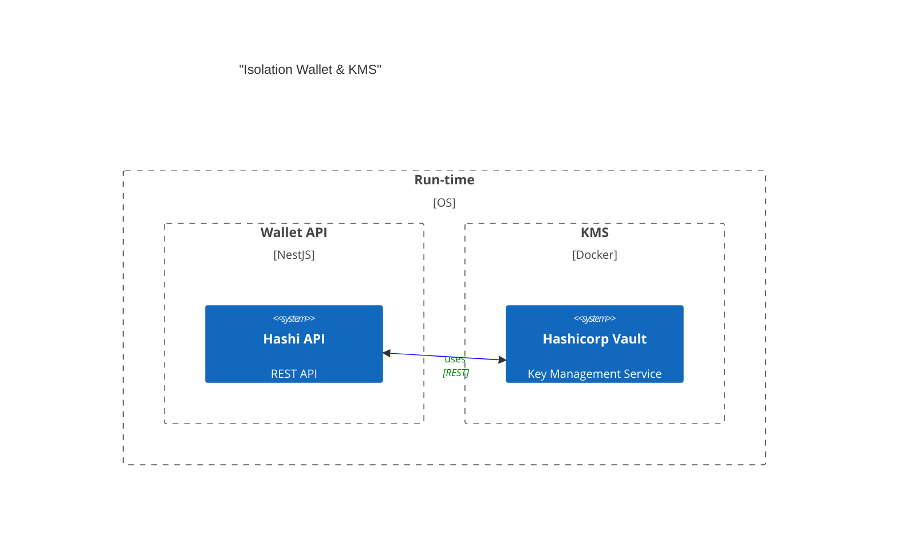

# Hashi - Vault-Based Wallet API

A secure wallet API service that uses Hashicorp Vault as a Key Management Service (KMS) to store and manage cryptographic keys for Algorand blockchain transactions. This service provides REST APIs for phone-number-based wallets, social authentication (Google OAuth), and transaction signing/submission.

## Features

- 🔐 **Secure Key Management**: Uses Hashicorp Vault for isolated key storage
- 📱 **Phone Wallet API**: Create and manage wallets using phone numbers
- 🔑 **Social Authentication**: Google OAuth integration with JWT tokens
- 💼 **Transaction Management**: Sign and submit Algorand transactions securely
- 🛡️ **Isolated Security**: Keys never leave the Vault, ensuring application isolation
- 📚 **API Documentation**: Swagger/OpenAPI docs available at `/docs`

## Why Hashicorp Vault

Managing and securing cryptographic keys is a fundamental requirement for any system and not special to blockchain applications. Hashicorp Vault is a popular and widely used KMS that provides a secure and scalable way to manage keys and secrets.

### Natively supports Ed25519 signature scheme

A big advantage of Vault in Algorand application design is that it doesn't require the integration of extra modules to support non-native signature schemes (i.e secp256k1). Ed25519 is natively supported and Vault's security model is maintained without relying on external modules.

## Architecture

This pattern ensures that applications comply with the principle of **ISOLATION** between application space and "trusted" space; i.e the KMS. Most web3 applications handle cryptographic keys in-memory and in the same run-time space as the application. This is a security risk as the keys can be easily compromised by an attacker who gains access to the application's memory space.

This ensures that if the application is compromised, the keys are still secure and cannot be accessed by the attacker.



## API Endpoints

### Phone Wallet API (`/v1/phone-wallet`)

- **POST `/v1/phone-wallet/create`** - Create or retrieve wallet for a phone number
  ```json
  {
    "phoneNumber": "+15551234567"
  }
  ```

- **GET `/v1/phone-wallet/address?phoneNumber=+15551234567`** - Get wallet address for a phone number

- **POST `/v1/phone-wallet/sign`** - Sign transaction using phone number's wallet
  ```json
  {
    "phoneNumber": "+15551234567",
    "transactionData": "base64_encoded_transaction"
  }
  ```

- **POST `/v1/phone-wallet/submit`** - Submit signed transaction to Algorand network
  ```json
  {
    "signedTransaction": "base64_encoded_signed_transaction"
  }
  ```

### Authentication API (`/v1/auth`)

- **POST `/v1/auth/google`** - Authenticate with Google OAuth token
  ```json
  {
    "token": "google_oauth_token"
  }
  ```
  Returns JWT token and wallet information

- **GET `/v1/auth/profile`** - Get user profile (requires JWT authentication)
  Headers: `Authorization: Bearer <jwt_token>`

- **GET `/v1/auth/wallet`** - Get user's wallet (requires JWT authentication)
  Headers: `Authorization: Bearer <jwt_token>`

- **POST `/v1/auth/refresh-wallet`** - Refresh user's wallet (requires JWT authentication)
  Headers: `Authorization: Bearer <jwt_token>`

### Transaction API (`/v1/transaction`)

- Standard transaction endpoints for crafting, signing, and submitting transactions

## Setup

### Prerequisites

- Node.js (v18+)
- Yarn or npm
- Docker and Docker Compose
- Hashicorp Vault (via Docker)

### 1. Install Dependencies

```bash
yarn install
```

### 2. Setup Vault

```bash
# Launch Vault
docker-compose up -d vault

# Initialize and unseal Vault (run once)
yarn run vault:init

# Setup transit engine (run once)
yarn run vault:transit
```

After initialization, you'll find the root token in `vault-seal-keys.json`. **Keep this secure!**

### 3. Configure Environment Variables

Copy `env.template` to `.env`:

```bash
cp env.template .env
```

Update `.env` with your configuration:

```env
# Vault Configuration
VAULT_TOKEN=your_vault_root_token_from_vault-seal-keys.json
VAULT_URL=http://localhost:8200

# Google OAuth Configuration (for social login)
GOOGLE_CLIENT_ID=your_google_client_id
GOOGLE_CLIENT_SECRET=your_google_client_secret

# JWT Configuration
JWT_SECRET=your_jwt_secret_key_here

# Algorand Network Configuration
NODE_HTTP_SCHEME=https
NODE_HOST=testnet-api.algonode.cloud
NODE_PORT=443
NODE_TOKEN=aaaaaaaaaaaaaaaaaaaaaaaaaaaaaaaaaaaaaaaaaaaaaaaaaaaaaaaaaaaaaaaa

# Genesis Configuration
GENESIS_ID=testnet-v1.0
GENESIS_HASH=SGO1GKSzyE7IEPItTxCByw9x8FmnrCDexi9/cOUJOiI=

# CORS Configuration
CORS_ORIGIN=http://localhost:5173

# Environment
NODE_ENV=development
```

### 4. Start the API Server

```bash
# Development mode (with hot reload)
yarn run start:dev

# Production mode
yarn run start:prod
```

The API will be available at `http://localhost:8081`

### 5. Access API Documentation

Once the server is running, visit:
- Swagger UI: `http://localhost:8081/docs`

## Integration with AlgoIntent

This Hashi service is integrated with the [AlgoIntent](https://github.com/caerlower/algo-intent) project:

- **Frontend**: The AlgoIntent web app uses the phone-wallet API to enable sending ALGO to phone numbers
- **WhatsApp Bot**: The WhatsApp bot uses the phone-wallet API for wallet operations

### Usage Example

```typescript
// Create wallet for phone number
const response = await fetch('http://localhost:8081/v1/phone-wallet/create', {
  method: 'POST',
  headers: { 'Content-Type': 'application/json' },
  body: JSON.stringify({ phoneNumber: '+15551234567' })
});

const { wallet } = await response.json();
console.log('Wallet address:', wallet.address);
```

## Transaction Flow

1. **Craft Transaction Model** - Create transaction using algo-models
2. **Encode** - Encode transaction to bytes
3. **Sign** - Sign using Vault (keys never leave Vault)
4. **Attach Signature** - Combine signature with transaction
5. **Re-Encode** - Encode signed transaction
6. **Submit** - POST to Algorand network

## Wallet Components

- **Local State** - Transaction state management
- **Networking** - Algorand network communication
- **KMS** - Hashicorp Vault integration
- **Data Models** - Algo-models for transaction crafting
- **Encoding** - Transaction encoding/decoding
- **API** - REST API endpoints

### Algo Models

This project relies on [algo-models](https://www.npmjs.com/package/@algorandfoundation/algo-models) to craft the transaction model.

#### Why not the AlgoSDK?

The AlgoSDK is a great tool for interacting with the Algorand network. However, the transaction models used as part of its APIs are not the real "raw" transaction models that are sent to the network. The SDK abstracts some data model handling, which might look easier for the developer to handle, but this means that if we want to integrate an agnostic, traditional KMS that doesn't understand how to manipulate the data models, it wouldn't produce valid signatures.

More information about this decision can be found [here](https://github.com/algorandfoundation/algo-models)

## REPL CLI (Optional)

For testing and development, you can use the REPL CLI:

```bash
yarn run start:dev -- --entryFile repl
```

Example usage in REPL:

```typescript
// Get Wallet Instance
w = get(Wallet)

// Generate / Get Public Key from Vault
addr = await w.getAddress()

// Get Transaction Crafter Instance
crafter = w.craft()

// Craft & Get PAY Transaction
tx = crafter.pay(100000, addr, addr)
# Vault Wallet
This repo is a demonstration of a wallet that uses 
Hashicorp Vault as a Key Management Service (KMS) to store 
and manage cryptographic keys. The wallet is a CLI 
application that allows users to interact with the wallet 
and KMS to craft, sign and submit transactions to the 
Algorand network.
Managing and securing cryptographic keys is a fundamental 
requirement for any system and not special to blockchain 
applications. 
Hashicorp Vault is a popular and widely used KMS that 
provides a secure and scalable way to manage keys and 
secrets.
A big advantage of Vault in Algorand application design is 
that it doesn't require the integration of extra modules to 
support non-native signature schemes (i.e secp256k1).
Ed25519 is natively supported and Vault's security model is 
maintained without relying on external modules.
## Transaction Steps
- Craft tx Model
- Encode
- Sign
- Attach Signature
- Re-Encode
- POST
## Conceptual Architecture

This pattern ensure that applications comply with the 
principle of **ISOLATION** between appliation space and 
"trusted" space; i.e the KMS.
Most web3 applications handle cryptographic keys in-memory 
and in the same run-time space as the application. This is 
a security risk as the keys can be easily compromised by an 
attacker who gains access to the application's memory space.
            Boundary(b1, "Wallet", "Docker") {
                System(app, "Wallet CLI", "wallet")
## Wallet Components
- Local State
- Networking
- KMS
- Data Models
- Encoding
- API
### Algo Models
This project relies on [algo-models](https://www.npmjs.com/
package/@algorandfoundation/algo-models) to craft the 
transaction model.
#### Why not the AlgoSDK? 
The AlgoSDK is a great tool for interacting with the 
Algorand network. However, the transaction models
used as part of it's API's are not the real "raw" 
transaction models that are sent to the network. The SDK 
abstracts some datal model handling, which might look 
easier for the developer to handle, but
this means that if we want to integrate an agnostic, 
traditional KMS that doesn't understand how to manipulate 
the data models, it wouldn't produce valid signatures.
More information about this decision can be found [here]
(https://github.com/algorandfoundation/algo-models)
## 1. Setup / Boot Vault
# Install local deps
$ yarn
$ docker-compose up -d vault
# Init and unseal Vault
$ yarn run vault:init
# Run this command only once during initial setup
$ yarn run vault:transit
## 2. Setup Proper ENVIRONMENT VARIABLES
In `.env` file, change `VAULT_TOKEN` to the root token 
generated by Vault. You can find this in `vault-seal-keys.
json` file.
Changes other variables as needed.
## 3. run Wallet REPL CLI
yarn run start:dev -- --entryFile repl 
It should look something like this:
```bash
[9:47:01 PM] Starting compilation in watch mode...
[9:47:04 PM] Found 0 errors. Watching for file changes.
[Nest] 9936  - 11/21/2024, 9:47:04 PM     LOG [NestFactory] 
Starting Nest application...
[Nest] 9936  - 11/21/2024, 9:47:04 PM     LOG 
[InstanceLoader] ChainModule dependencies initialized
[Nest] 9936  - 11/21/2024, 9:47:04 PM     LOG 
[InstanceLoader] HttpModule dependencies initialized
[Nest] 9936  - 11/21/2024, 9:47:04 PM     LOG 
[InstanceLoader] ConfigHostModule dependencies initialized
[Nest] 9936  - 11/21/2024, 9:47:04 PM     LOG 
[InstanceLoader] VaultModule dependencies initialized
[Nest] 9936  - 11/21/2024, 9:47:04 PM     LOG 
[InstanceLoader] ConfigModule dependencies initialized
[Nest] 9936  - 11/21/2024, 9:47:04 PM     LOG 
[InstanceLoader] WalletModule dependencies initialized
[Nest] 9936  - 11/21/2024, 9:47:04 PM     LOG REPL 
initialized
> 
If an error message is displayed along side the LOG 
messages, please check the `.env` file and ensure that the 
`VAULT_TOKEN` is set correctly and that vault is running. 
## 4. Commands to craft, encode, sign and POST a transaction
Submit each command individually. This is just a 
demonstration of the steps involved in crafting and sending 
a transaction.
### Get Wallet Instance
```ts
w = get(Wallet) 
### Generate / Get Public Key from Vault and encode it into 
an Algorand Address
```ts
addr = await w.getAddress() 
```

### Get Transaction Crafter Instance
```ts
crafter = w.craft() 
```

### Craft & Get PAY Transaction
```ts
    .addFirstValidRound(46005730) //adjust this value
    .addLastValidRound(46005808) //adjust this value
    .get()

// Encode Transaction
encoded = tx.encode()

// Sign encoded payload
sig = await w.sign(encoded)

// Attach Signature to Encoded Payload
ready = crafter.addSignature(encoded, sig)

// Submit Transaction
await w.submitTransaction(ready)
```

## Security Notes

- **Never commit `.env` file** - It contains sensitive tokens and secrets
- **Keep `vault-seal-keys.json` secure** - Contains Vault root token
- **Use environment-specific secrets** - Different secrets for dev/staging/prod
- **Rotate JWT secrets regularly** - For production deployments
- **Restrict CORS origins** - Update `CORS_ORIGIN` in production

## Troubleshooting

### Vault Connection Issues

If you see errors about Vault connection:
1. Ensure Vault is running: `docker ps | grep vault`
2. Check `VAULT_TOKEN` in `.env` matches the token in `vault-seal-keys.json`
3. Verify Vault is unsealed: `docker exec -it vault vault status`

### Port Already in Use

If port 8081 is already in use:
1. Change port in `src/main.ts` (default: 8081)
2. Or kill the process using the port: `lsof -ti:8081 | xargs kill`

